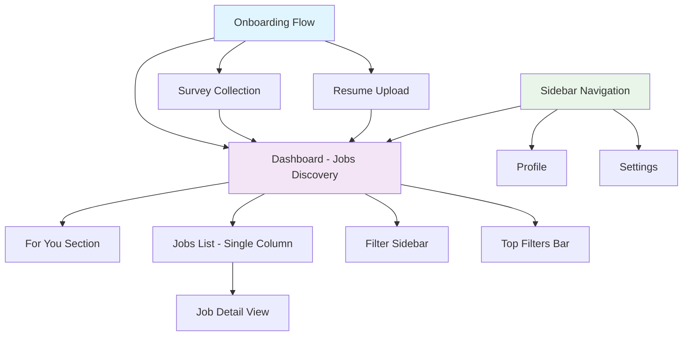
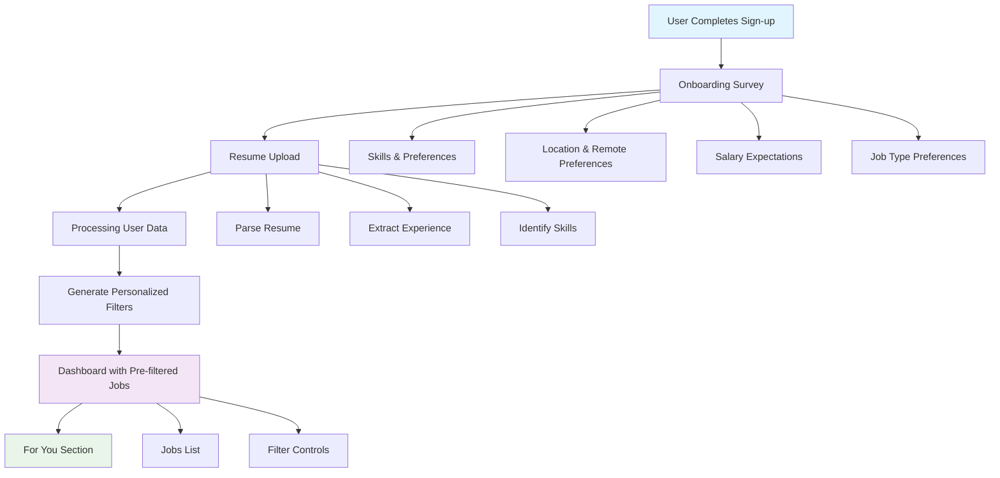
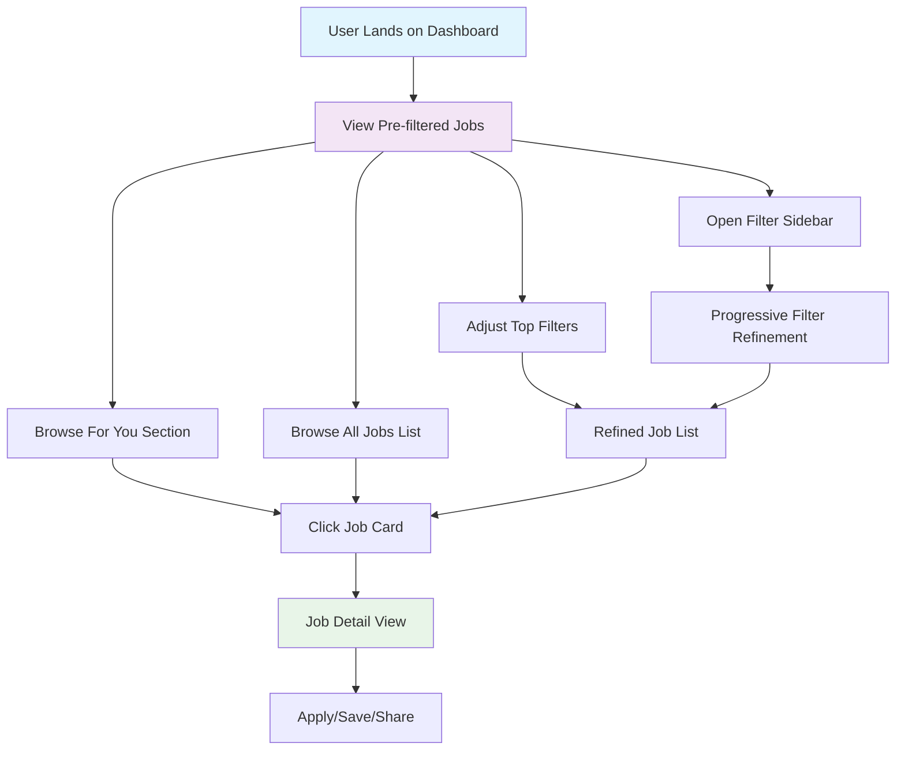
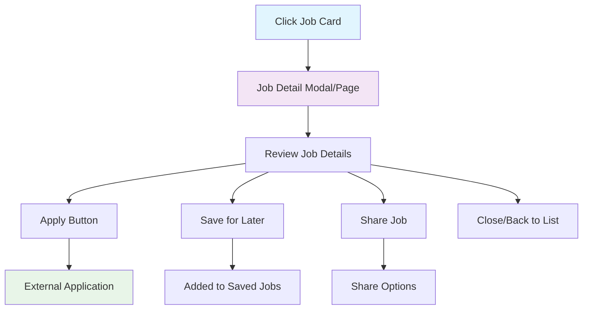

# Dashboard Updates UI/UX Specification

## Introduction

This document defines the user experience goals, information architecture, user flows, and visual design specifications for the dashboard updates based on CEO feedback. It serves as the foundation for visual design and frontend development, ensuring a cohesive and user-centered experience.

### CEO Feedback Summary

**Key Updates Required:**
- Remove sections from the header
- Remove gamification elements
- Add onboarding checklist
- Remove turbo
- Add side nav bar with Jobs, Profile and Settings
- Display filters above jobs column
- Add sidebar to change filters
- Add For you section
- Make one job per column + update job card designs

**Initial User Flow:**
- From onboarding we collect user data from i) onboarding survey and ii) resume
- Once user land to dashboard they will see pre-filtered data

### Document Purpose and Scope

This specification focuses on redesigning the dashboard interface to create a more streamlined, professional experience that removes gamification elements and emphasizes job matching through personalized filtering and recommendations.

---

## Overall UX Goals & Principles

### Target User Personas

**Job Seekers - Primary User:**
- Professionals actively seeking new opportunities
- Need efficient filtering and discovery of relevant positions
- Value clear, uncluttered interfaces over flashy elements
- Want personalized job recommendations based on their profile

**Onboarding Users:**
- New users completing initial setup
- Need guided experience to provide necessary data
- Want clear progress indicators and expectations
- Require seamless transition to main dashboard

### Usability Goals

- **Efficiency of Discovery:** Users can quickly find relevant jobs through smart filtering
- **Personalization Effectiveness:** Pre-filtered data based on onboarding reduces noise
- **Navigation Clarity:** Clear sidebar navigation eliminates confusion
- **Onboarding Completion:** Smooth data collection process with clear progress
- **Content Focus:** Removal of gamification keeps users focused on job search

### Design Principles

1. **Clarity over Gamification** - Remove distracting elements, focus on core job search functionality
2. **Data-Driven Personalization** - Use collected user data to surface most relevant opportunities
3. **Progressive Filtering** - Allow users to refine results without overwhelming initial view
4. **Consistent Navigation** - Maintain clear information hierarchy through sidebar structure
5. **Efficiency First** - Streamline every interaction to reduce time-to-value

---

## Information Architecture (IA)

### MVP Release Strategy: Jobs Discovery First

**Core Value Focus:** This specification prioritizes the essential job discovery and filtering experience. Advanced features like Kanban-based job tracking will be delivered in subsequent releases.

### Site Map / Screen Inventory

### Navigation Structure

**Primary Navigation:** Persistent sidebar with three core sections:
- Jobs (default/primary view)
- Profile (user data management)
- Settings (preferences and account)

**Secondary Navigation:** 
- Filter controls (top bar + sidebar for progressive refinement)
- Section navigation within Jobs (For You, All Jobs)
- Job detail modal/overlay system

**Breadcrumb Strategy:** Minimal breadcrumbs due to flat navigation structure. Context maintained through sidebar active states and clear section headers.

### Future Features (Post-MVP)
- Kanban-based job tracking
- Application management
- Interview scheduling
- Saved searches
- Job alerts and notifications

---

## User Flows

### Onboarding to Dashboard Flow

**User Goal:** Complete setup and reach personalized job discovery dashboard

**Entry Points:** Sign-up completion, first-time login

**Success Criteria:** User reaches dashboard with pre-filtered, relevant job listings

#### Flow Diagram

#### Edge Cases & Error Handling:
- Resume upload fails: Allow manual entry of key information
- Survey partially completed: Save progress, allow completion later
- No matching jobs: Show broader results with explanation
- Data processing delays: Show loading state with progress indicator

**Notes:** Onboarding data immediately impacts dashboard filtering - no additional configuration step needed.

### Dashboard Job Discovery Flow

**User Goal:** Find and engage with relevant job opportunities

**Entry Points:** Dashboard landing, returning user sessions

**Success Criteria:** User identifies jobs of interest and takes next action (save, apply, learn more)

#### Flow Diagram

#### Edge Cases & Error Handling:
- No results after filtering: Suggest filter adjustments
- Job no longer available: Show alternative similar roles
- Slow loading: Progressive loading with skeleton screens
- Filter conflicts: Auto-resolve or highlight conflicts

**Notes:** Single-column layout reduces decision fatigue. Filter sidebar maintains context while allowing refinement.

### Job Interaction Flow

**User Goal:** Evaluate and take action on specific job opportunities

**Entry Points:** Job card click, direct job link

**Success Criteria:** User successfully applies, saves, or shares job opportunity

#### Flow Diagram

#### Edge Cases & Error Handling:
- Application link broken: Show alternative contact methods
- Job expired: Suggest similar active roles
- Save functionality fails: Retry mechanism with feedback
- Share service unavailable: Fallback options

**Notes:** Streamlined interaction focused on core actions. External application process maintains user context.

---

## Component Library / Design System

### Design System Approach
**MVP Component Strategy:** Focus on essential components for job discovery. Leverage existing design tokens where possible, create new components only for dashboard-specific functionality.

### Core Components

#### Sidebar Navigation
**Purpose:** Primary navigation for Jobs, Profile, and Settings sections

**Variants:** 
- Expanded (default desktop)
- Collapsed (mobile/narrow screens)

**States:** 
- Active section highlighted
- Hover states for interactive elements
- Loading states during navigation

**Usage Guidelines:** Always visible on desktop, collapsible on mobile. Clear visual hierarchy with active state indication.

#### Job Card - Single Column
**Purpose:** Display job opportunity in streamlined single-column layout

**Variants:**
- Standard job card
- Featured/promoted job card
- Saved job card (with saved indicator)

**States:**
- Default
- Hover (with subtle elevation)
- Loading (skeleton placeholder)
- Error (job no longer available)

**Usage Guidelines:** Remove gamification elements. Focus on essential job details: title, company, location, salary range, key requirements. One card per row for better readability.

#### Filter Controls
**Purpose:** Progressive job filtering system

**Variants:**
- Top filter bar (quick filters)
- Filter sidebar (comprehensive filtering)
- Filter chips (applied filters display)

**States:**
- Default
- Active (filters applied)
- Loading (while filtering)
- Error (no results)

**Usage Guidelines:** Top bar for common filters (location, remote, salary). Sidebar for detailed filtering. Clear visual feedback for applied filters.

#### For You Section
**Purpose:** Personalized job recommendations based on onboarding data

**Variants:**
- Horizontal scroll (mobile)
- Grid layout (desktop)

**States:**
- Loaded with recommendations
- Loading personalized content
- No recommendations available

**Usage Guidelines:** Prominently display personalized matches. Clear indication of why jobs are recommended. Easy access to full job details.

#### Onboarding Survey
**Purpose:** Collect user preferences and requirements

**Variants:**
- Multi-step form
- Progress indicator
- Skip options for optional fields

**States:**
- Active step
- Completed step
- Error validation
- Final submission

**Usage Guidelines:** Clear progress indication. Logical flow from basic to detailed preferences. Save progress between sessions.

#### Resume Upload
**Purpose:** Capture user experience and skills data

**Variants:**
- Drag-and-drop interface
- File browser selection
- Manual entry fallback

**States:**
- Upload ready
- Uploading with progress
- Upload complete
- Upload error with retry

**Usage Guidelines:** Support multiple file formats. Clear feedback during processing. Fallback for manual entry if upload fails.

---

## Next Steps

### Immediate Actions

1. **Stakeholder Review** - Share specification with CEO and development team for feedback
2. **Technical Architecture Planning** - Collaborate with development team on implementation approach
3. **Create Visual Mockups** - Design high-fidelity mockups for key screens in design tool
4. **Data Requirements Analysis** - Define data structures for personalization and filtering
5. **Component Priority Planning** - Sequence component development based on user flow criticality

### MVP Implementation Sequence

**Phase 1: Foundation (Week 1-2)**
- Sidebar navigation structure
- Basic job card design (single column)
- Core data models for jobs and user preferences

**Phase 2: Onboarding (Week 3-4)**
- Survey component implementation
- Resume upload functionality
- Data processing pipeline for personalization

**Phase 3: Job Discovery (Week 5-6)**
- Dashboard layout with "For You" section
- Filter controls (top bar and sidebar)
- Job detail view and interaction

**Phase 4: Polish & Optimization (Week 7-8)**
- Performance optimization
- Mobile responsiveness
- Error handling and edge cases

### Design Handoff Checklist

- [x] All user flows documented
- [x] Component inventory complete
- [ ] Accessibility requirements defined
- [ ] Responsive strategy detailed
- [ ] Brand guidelines incorporated
- [ ] Performance goals established
- [ ] Visual mockups created
- [ ] Development-ready specifications

### Key Success Metrics

**User Engagement:**
- Time to first job interaction (target: <30 seconds)
- Onboarding completion rate (target: >80%)
- Jobs viewed per session (target: >5)

**Personalization Effectiveness:**
- Click-through rate on "For You" recommendations (target: >15%)
- Filter usage patterns
- Job save/apply conversion rates

**Technical Performance:**
- Page load time (target: <2 seconds)
- Filter response time (target: <500ms)
- Mobile usability score (target: >90)

---

## Document Status

**Version:** 1.0
**Last Updated:** [Current Date]
**Status:** Ready for Review
**Next Review:** Post-stakeholder feedback

**Key Changes:**
- Initial specification based on CEO feedback
- MVP focus on Jobs Discovery core value
- Removal of gamification elements
- Addition of personalized filtering system

---
